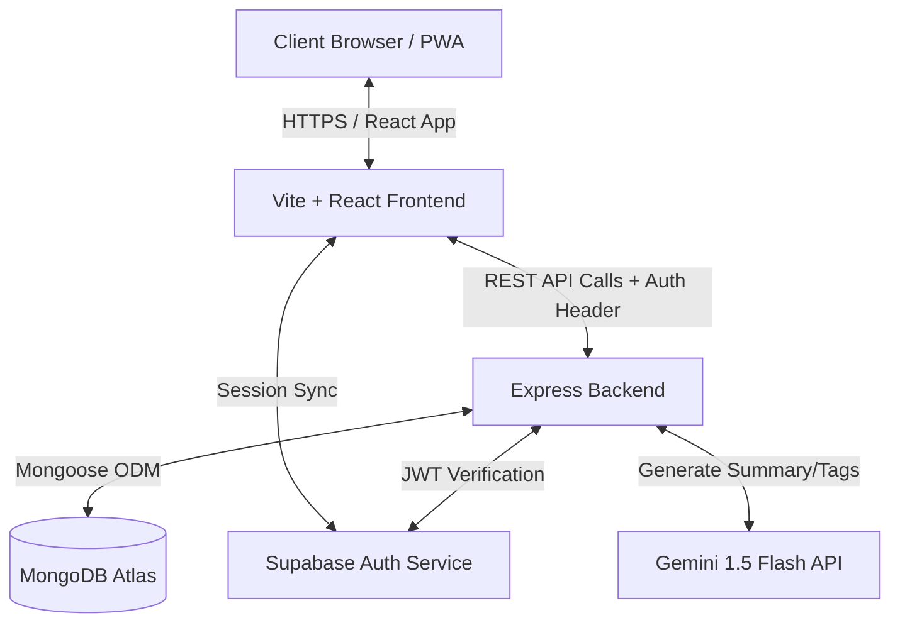
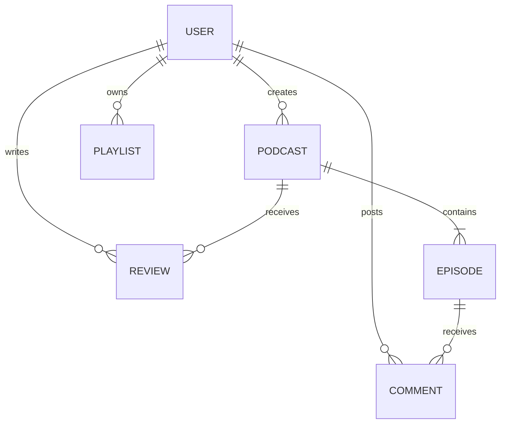

# AetherCast - Production-Style MERN Podcast Streaming Service

AetherCast is a production-ready, high-fidelity MERN stack podcast platform designed for independent creators and listeners. This application features secure Supabase authentication, automatic resume-playback, synchronized live lyrics/subtitles, canvas-based audio visualization, offline downloads, creator dashboards, AI-powered summaries, and a role-based admin command center.

### 🌐 Live Deployments
- **Frontend App**: [aether-cast-mern.vercel.app](https://aether-cast-mern.vercel.app/)
- **Backend API**: [podcast-backend-3lt7.onrender.com](https://podcast-backend-3lt7.onrender.com)

---

## 🛠️ Tech Stack & Architecture

- **Frontend**: React (Vite), Context API, React Router, Lucide Icons, Canvas API, Service Workers (PWA).
- **Backend**: Node.js, Express.js, MVC Architecture, Mongoose ODM.
- **Database**: MongoDB Atlas.
- **Security**: Supabase Auth (Asymmetric ES256 JWT validation), Helmet, CORS, Express Rate Limit.
- **AI Engine**: Gemini 1.5 Flash API (with smart fallback).

### System Architecture Diagram


### Entity Relationship Diagram (ERD)


---

## 🔑 Key Features

### Listener Features
- **Global Sticky Player**: Persistent bottom audio player that continues streaming seamlessly during page transitions.
- **PWA & Offline Cache**: Fully installable PWA with Service Worker audio caching. Download podcasts for offline playback.
- **Listen History & Likes**: Keep track of played episodes and build a list of liked tracks.
- **Sleep Timer & Speed Controls**: Toggle playback speeds (0.5x - 2.0x) and set timers (15m, 30m, 45m, 60m).
- **Live Synced Subtitles**: Subtitles sync in real-time with the audio scroll.
- **Keyboard Shortcuts**: Space (Play/Pause), Left/Right Arrows (Seek ±10s), M (Mute).

### Creator Features
- **Creator Dashboard**: Manage shows, publish episodes, and view charts.
- **Recording Booth**: Live voice recording directly from the browser with a real-time waveform visualizer.
- **AI Summary & Smart Tagging**: One-click AI generation of episode summaries and tagging using Gemini 1.5 Flash.

### Admin Command Center
- **System Governance Dashboard**: Overview metrics cards.
- **User Accounts Panel**: Search/filter users, edit system roles, and suspend/reactivate accounts.
- **Content Moderation Queue**: Review flagged comments or reviews, dismiss flags, or delete content.

---

## 📂 Project Directory Structure

```
├── backend/
│   ├── src/
│   │   ├── controllers/      # MVC Controllers
│   │   ├── models/           # Mongoose Database Models
│   │   ├── routes/           # Express API Endpoints
│   │   ├── middlewares/      # Auth & Upload Middlewares
│   │   ├── utils/            # Email & Utility helpers
│   │   ├── app.js            # Express configurations
│   │   └── server.js         # Entry node worker
│   └── package.json
│
├── frontend/
│   ├── src/
│   │   ├── components/       # Reusable React components
│   │   ├── context/          # Context API providers
│   │   ├── pages/            # View Pages
│   │   ├── main.jsx          # Entry bootloader
│   │   └── index.css         # Neon design token sheets
│   ├── public/
│   │   ├── manifest.json     # PWA manifests
│   │   └── sw.js             # Service Worker
│   └── package.json
│
├── package.json              # Root concurrent startup
└── README.md
```

---

## 🚀 Installation & Setup

### 1. Prerequisites
- Node.js (v18+)
- MongoDB Atlas cluster URL
- Supabase Project URL & Anon Key

### 2. Backend Configurations
Create a `.env` file in the `/backend` folder:
```env
PORT=5000
MONGO_URI=your_mongodb_atlas_connection_string
JWT_SECRET=your_jwt_secret
CLIENT_URL=http://localhost:5173
SUPABASE_URL=your_supabase_url
SUPABASE_ANON_KEY=your_supabase_anon_key
SUPABASE_JWT_SECRET=your_supabase_jwt_secret
GEMINI_API_KEY=your_google_gemini_api_key
```

### 3. Frontend Configurations
Create a `.env` file in the `/frontend` folder:
```env
VITE_SUPABASE_URL=your_supabase_url
VITE_SUPABASE_ANON_KEY=your_supabase_anon_key
```

### 4. Running Locally
From the root directory, install dependencies and start the servers concurrently:
```bash
npm run install-all
npm run dev
```
- Frontend will open at `https://aether-cast-mern.vercel.app/`
- Backend API will run at `https://podcast-backend-3lt7.onrender.com`

---

## 📝 API Endpoint Documentation

| HTTP Method | Endpoint | Description | Auth Required | Role |
| :--- | :--- | :--- | :--- | :--- |
| **POST** | `/api/auth/register` | Register new user profile | Public | Any |
| **POST** | `/api/auth/login` | Log in user | Public | Any |
| **POST** | `/api/podcasts` | Create a new podcast show | Private | Creator/Admin |
| **GET** | `/api/podcasts` | List all published podcasts | Public | Guest/User |
| **POST** | `/api/podcasts/:id/episodes` | Upload a new podcast episode | Private | Creator/Admin |
| **POST** | `/api/episodes/:id/like` | Like or unlike an episode | Private | Listener/Creator/Admin |
| **POST** | `/api/episodes/:id/ai-features` | Generate AI summaries and tags | Private | Creator/Admin |
| **GET** | `/api/admin/stats` | Retrieve platform-wide metrics | Private | Admin |
| **PUT** | `/api/admin/users/:id/status` | Suspend or reactivate user | Private | Admin |
