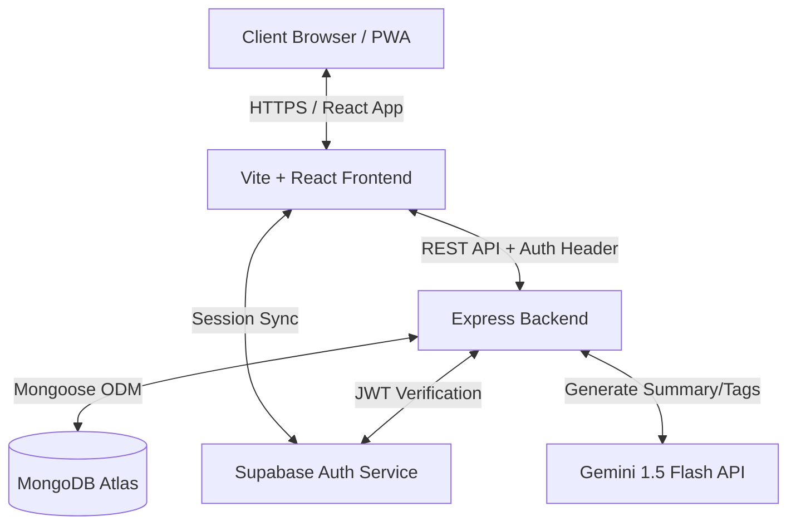
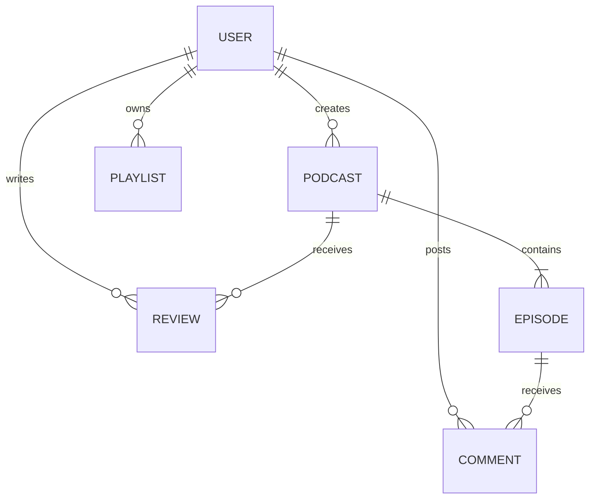

# AetherCast — Production-Style MERN Podcast Streaming Platform

AetherCast is a production-ready, full-featured MERN stack podcast platform built for independent creators, listeners, and administrators. It features a custom green/dark dual-theme UI, a global sticky audio player, Supabase-secured authentication, interactive transcripts, AI-powered summaries, a creator drafts workspace, real-time listening parties, a full admin command center, and a premium custom cursor and navbar experience.

### 🌐 Live Deployments
- **Frontend App**: [aether-cast-mern.vercel.app](https://aether-cast-mern.vercel.app/)
- **Backend API**: [podcast-backend-3lt7.onrender.com](https://podcast-backend-3lt7.onrender.com)

---

## 🛠️ Tech Stack & Architecture

- **Frontend**: React 18 (Vite), Context API, React Router v6, Lucide Icons, Canvas API, IntersectionObserver, Service Workers (PWA).
- **Backend**: Node.js, Express.js, MVC Architecture, Mongoose ODM, Multer file uploads.
- **Database**: MongoDB Atlas.
- **Auth**: Supabase Auth (Asymmetric ES256 JWT validation), optional Google OAuth.
- **AI Engine**: Google Gemini 1.5 Flash API (with graceful fallback).
- **Deployment**: Vercel (frontend) + Render (backend).

### System Architecture Diagram


### Entity Relationship Diagram (ERD)


---

## 🔑 Key Features

### 🎧 Listener Features
- **Global Sticky Player** — Persistent bottom audio player that streams seamlessly across all page navigations.
- **PWA & Offline Cache** — Fully installable Progressive Web App with Service Worker audio caching for offline listening.
- **Listen History & Likes** — Automatic history tracking with a liked episodes library.
- **Sleep Timer & Speed Controls** — Playback speeds (0.5x–2.0x) and auto-stop timers (15, 30, 45, 60 min).
- **Live Synced Transcripts** — Interactive transcripts scroll and highlight word-by-word in sync with the audio.
- **Listening Parties** — Real-time multi-user listening sessions with live chat, synchronized playback, and reaction emoji bursts.
- **Keyboard Shortcuts** — `Space` (Play/Pause), `←/→` (Seek ±10s), `M` (Mute).
- **Ratings & Reviews** — Star ratings and written reviews per podcast show with a flag/report system.

### 🎙️ Creator Features
- **Creator Workspace** — Full dashboard to manage shows, publish episodes, and view listener analytics charts.
- **Drafts Workspace** — Dedicated tab to manage all draft podcast shows and draft episodes, with one-click publishing.
- **Podcast Editing** — Edit any of your podcast show's title, description, category, language, status, cover art, and banner image directly from the show page.
- **Recording Booth** — In-browser voice recording with a live canvas waveform visualizer.
- **Episode Upload** — Upload `.mp3`/`.wav` files with title, description, transcript, and episode status (draft/published).
- **AI Summary & Smart Tagging** — Gemini 1.5 Flash generates professional episode summaries and search tags from your description or transcript.
- **Interactive Transcript Editor** — Upload and inline-edit episode transcripts with a find & replace tool.
- **Category Cover Art** — Automatic category-based cover art assignment for podcasts without custom artwork.

### 🛡️ Admin Command Center
- **Metrics Overview** — Platform-wide stats: users, podcasts, episodes, comments, and moderation queue counts.
- **User Accounts Panel** — Search, filter, edit roles, and suspend/reactivate user accounts.
- **Content Moderation Queue** — Review flagged comments and reviews, dismiss flags, or permanently delete content.
- **Podcasts CRUD** — Full admin-level create, read, update, and delete access across all podcast shows.
- **Episodes CRUD** — Admin-level management of all platform episodes.

### ✨ UI & Experience
- **Dual Theme** — Green accent light mode (default) + dark mode with orange accent, toggled via the navbar.
- **Custom Glowing Cursor** — Replaces the default cursor with a glowing dot + lagging ring that expands on hover over interactive elements.
- **Enhanced Navbar** — Scroll-triggered blur/glass effect, active page indicator dot, liquid underline animation on hover, and magnetic button physics.
- **Info Directory Effects** — Spotlight cursor glow, sound pulse rings on numbers, speaker equalizer bars below titles, and animated progress line fill on hover.
- **Scroll-In Reveal** — Page sections animate in as you scroll down.

---

## 📂 Project Directory Structure

```
├── backend/
│   ├── src/
│   │   ├── controllers/      # MVC Controllers
│   │   ├── models/           # Mongoose Database Models
│   │   ├── routes/           # Express API Endpoints
│   │   ├── middlewares/      # Auth & Upload Middlewares
│   │   ├── utils/            # Email & Utility helpers
│   │   ├── app.js            # Express configurations
│   │   └── server.js         # Entry node worker
│   └── package.json
│
├── frontend/
│   ├── src/
│   │   ├── components/       # Reusable React components (Navbar, AudioPlayer, CustomCursor, etc.)
│   │   ├── context/          # Context API (Auth, Player, Theme)
│   │   ├── pages/            # View Pages (Landing, Explore, PodcastDetails, CreatorDashboard, etc.)
│   │   ├── main.jsx          # Entry bootloader
│   │   └── index.css         # Design token system (CSS variables, themes, animations)
│   ├── public/
│   │   ├── manifest.json     # PWA manifest
│   │   └── sw.js             # Service Worker
│   └── package.json
│
├── vercel.json               # Vercel multi-service deployment config
├── package.json              # Root concurrent startup
└── README.md
```

---

## 🚀 Installation & Setup

### 1. Prerequisites
- Node.js v18+
- MongoDB Atlas cluster URL
- Supabase Project URL & Anon Key
- Google Gemini API Key (optional, for AI features)

### 2. Backend Configuration
Create a `.env` file in the `/backend` folder:
```env
PORT=5000
MONGO_URI=your_mongodb_atlas_connection_string
JWT_SECRET=your_jwt_secret
CLIENT_URL=http://localhost:5173
SUPABASE_URL=your_supabase_url
SUPABASE_ANON_KEY=your_supabase_anon_key
SUPABASE_JWT_SECRET=your_supabase_jwt_secret
GEMINI_API_KEY=your_google_gemini_api_key
```

### 3. Frontend Configuration
Create a `.env` file in the `/frontend` folder:
```env
VITE_SUPABASE_URL=your_supabase_url
VITE_SUPABASE_ANON_KEY=your_supabase_anon_key
VITE_GOOGLE_CLIENT_ID=your_google_oauth_client_id
```

### 4. Running Locally
From the root directory, install all dependencies and start both servers concurrently:
```bash
npm run install-all
npm run dev
```
- Frontend dev server: `http://localhost:5173`
- Backend API server: `http://localhost:5000`

---

## 📝 API Endpoint Reference

| Method | Endpoint | Description | Auth | Role |
| :--- | :--- | :--- | :--- | :--- |
| `POST` | `/api/auth/register` | Register a new user | Public | Any |
| `POST` | `/api/auth/login` | Log in user | Public | Any |
| `GET` | `/api/podcasts` | List published podcasts (own drafts visible to creator) | Optional | Guest/User |
| `POST` | `/api/podcasts` | Create a new podcast show | Private | Creator/Admin |
| `PUT` | `/api/podcasts/:id` | Update podcast show metadata & artwork | Private | Creator/Admin |
| `DELETE` | `/api/podcasts/:id` | Delete a podcast show | Private | Creator/Admin |
| `POST` | `/api/podcasts/:id/episodes` | Upload a new episode | Private | Creator/Admin |
| `PUT` | `/api/episodes/:id` | Update episode metadata or status (draft→published) | Private | Creator/Admin |
| `POST` | `/api/episodes/:id/like` | Like or unlike an episode | Private | Listener+ |
| `POST` | `/api/episodes/:id/ai-features` | Generate AI summary & tags | Private | Creator/Admin |
| `GET` | `/api/admin/stats` | Platform-wide metrics | Private | Admin |
| `PUT` | `/api/admin/users/:id/status` | Suspend or reactivate a user | Private | Admin |
| `PUT` | `/api/admin/users/:id/role` | Change a user's role | Private | Admin |
